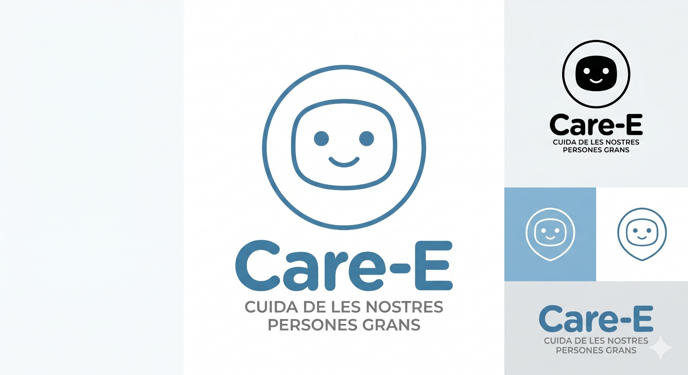
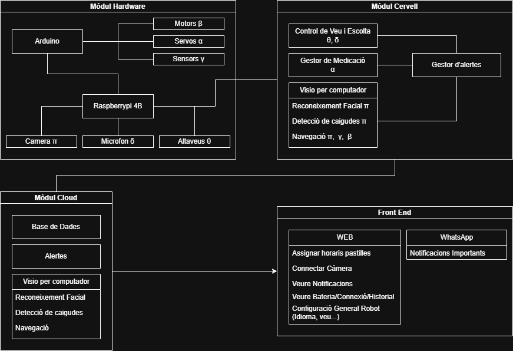
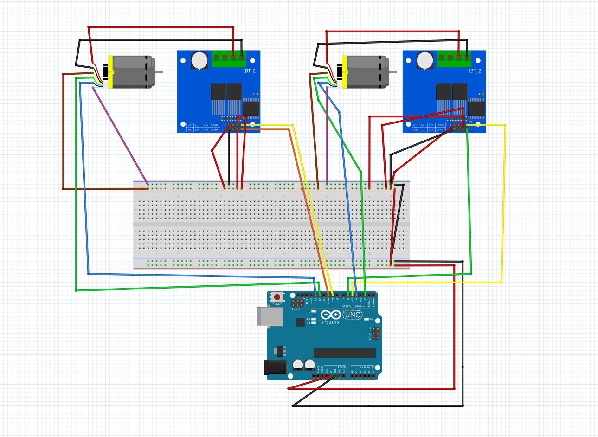
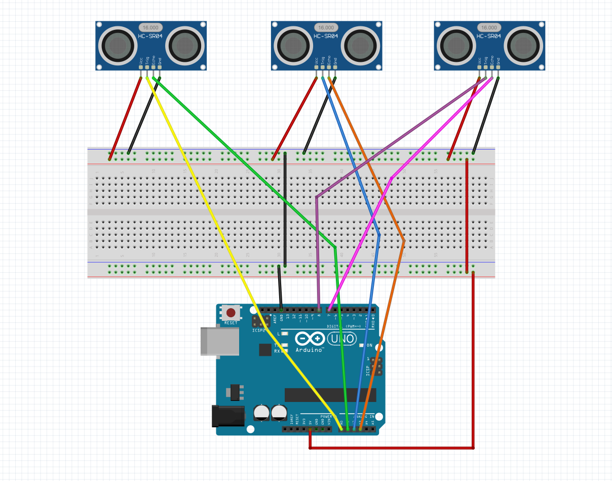
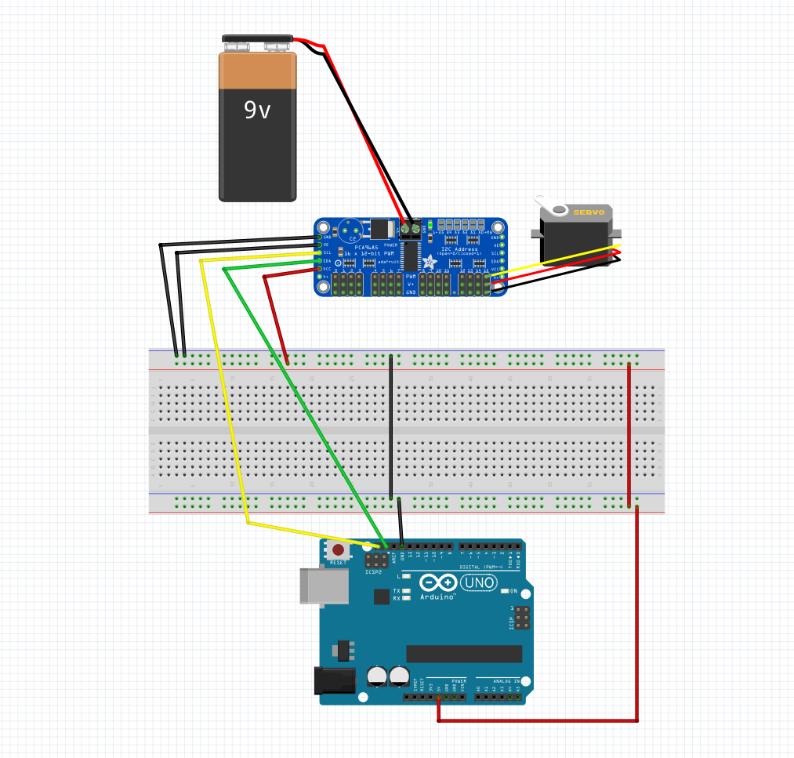

# Care-E: Assistent Robòtic Autònom per a la Gestió de Medicació

## Índex

- [Descripció](#descripció)
- [Arquitectura del Repositori](#arquitectura-del-repositori)
- [Dependències](#dependències)
- [SetUp i instal·lació](#setup-i-instal·lació)
- [Components](#components)
- [Detalls](#detalls)
  - [Software](#software)
  - [Hardware](#hardware)
- [Llibreries i eines utilitzades](#llibreries-i-eines-utilitzades)
- [Requisits de Maquinari](#requisits-de-maquinari)
- [Conceptes tècnics](#conceptes-tècnics)
  - [Navegació Autònoma i visió per computador](#navegació-autònoma-i-visió-per-computador)
  - [Interacció Cognitiva (IA)](#interacció-cognitiva-ia)
  - [Plataforma Cloud](#plataforma-cloud)
- [Vídeo de demostració](#vídeo-de-demostració)
- [Next Steps](#next-steps)
- [Referències](#referències)
- [Desenvolupadors](#desenvolupadors)

## Descripció

Aquest projecte consisteix en el desenvolupament d'un robot assistencial intel·ligent destinat a millorar la qualitat de vida de les persones grans que viuen soles. L'objectiu principal és oferir suport en les activitats quotidianes, augmentar la seguretat de l'usuari i proporcionar una eina de comunicació i acompanyament tant per a la persona com per als seus familiars.

El robot integra tecnologies de visió artificial, intel·ligència artificial, navegació autònoma i interacció per veu per actuar de manera proactiva dins de l'entorn domèstic.

## Arquitectura del Repositori

Aquest projecte segueix una estructura de monorepo dividida en quatre parts principals:

* `/1_arduino_hardware`
  - Codi Arduino en C++ per controlar el xassís, servos, ultrasons i engranatges.
  - Inclou esbossos d'exemple i un menú serial per provar moviments, tests de motors i dispensació.

* `/2_raspberry_brain`
  - Pipeline de visió per computador amb Python.
  - `vision/mainRecCares.py` inicia la càmera i fa la detecció i el reconeixement de cares.
  - La carpeta `vision/deteccio_cares` conté els mòduls de detecció (`dlib`), reconeixement (`DeepFace`) i filtre de Kalman.

* `/3_web_cloud`
  - Aplicació web `care` construïda amb Next.js.
  - Serveis backend que gestionen comandes del robot, TTS, veu i accions de dispensació.
  - API routes per a `robot-action`, `robot-voice`, `tts` i altres funcionalitats.

* `/4_design_models`
  - Arxius de disseny 3D i fitxers STL del xassís i del dispensador.

## Dependències

* 
* 
* 
* 
* 
* 
* 
* 

## SetUp i instal·lació

### Entorn Python

1. Crear l'entorn Conda amb `environment.yml`:
   - `conda env create -f environment.yml`
2. Activar l'entorn:
   - `conda activate care`
3. Comprovar que Python 3.12 està activat.

### Aplicació web

1. Anar a `3_web_cloud/care`.
2. Instal·lar dependències Node:
   - `npm install`
3. Executar en mode desenvolupament:
   - `npm run dev`

### Arduino

1. Obrir `1_arduino_hardware/src/care.ino` en l'IDE d'Arduino.
2. Carregar el firmware a una placa Arduino UNO.
3. Connectar els servos, els motors i els sensors segons el cablejat definit a `src/`.

## Components

En aquesta secció mostrem els components principals utilitzats per tal de dur a terme el projecte, així com les unitats utilitzades de cadascun i el seu preu corresponent. 

| Nom                           | Unitats | Preu        |
|-------------------------------|---------|-------------|
| Cámara Fisheye 5MP            |   1     |  29,95€     |
| Raspberry Pi 5 /4 B           |   1     |  97,95€     |
| Arduino Uno                   |   1     |  23,95€     |
| Controlador PWM 16 canales    |   1     |  7,20€      |
| Servomotor digital MG996R     |   5     |  6,50€      |
| Micro servo miniatura SG90    |   4     |  2,30 €     |
| Sensor de ultrasonidos HC-SR04|   3     |  1,80 €     |
| Motor 20D - 250:1 (12V)       |   2     |  37,95 €    |
| Controladora motor            |   2     |  5,95€      |
| Micro USB                     |   1     |  10€        |
| Bateria 14V                   |   1     |  20€        |
| Power bank 5000mAh            |   1     |  12€        |
| Step down 5V                  |   1     |  6,30€      |
| Step down 12V                 |   1     |  4,50€      |
| Altaveu                       |   1     |  4,30€      |
| Amplificador                  |   1     |  6,50€      |
| **Total**                     |         |**357,55€** |

Els components detallats són per a la producció d'un únic robot.

## Detalls

En aquest apartat es descriu l'arquitectura de software utilitzada i les especificacions de les connexions de hardware realitzades.

### Software

En la següent figura es pot observar l'arquitectura del software desenvolupada i com es connecten els diferents mòduls.

### Hardware

En aquesta secció detallem les connexions de hardware amb els esquemes de cadascun dels components principals realitzats amb l'aplicació Fritzing

#### Esquema connexió motors

#### Esquema connexió ultrasons

#### Esquema connexió servos

## Llibreries i eines utilitzades

- Python: `opencv-python`, `dlib`, `deepface`, `tensorflow`, `flask`, `requests`, `python-dotenv`.
- Node: `next`, `react`, `@google-cloud/text-to-speech`, `@google/genai`, `@supabase/supabase-js`, `tailwindcss`.
- Desenvolupament: Arduino IDE, Conda, Git, CoppeliaSim, Fusion, Fritzing, Visual Studio Code

## Requisits de Maquinari
* **Processament:** Raspberry Pi 5 (Cervell) + Arduino UNO R3 (Controlador de maquinari).
* **Sensors:** Càmera Fisheye 5MP, Micròfon USB, 3x Ultrasons HC-SR04.
* **Actuadors:** 2x Motors DC 250:1 (Tracció), Servo 360º (Dispensador), Servos MG996R (Pan & Tilt).
* **Energia:** Bateria LiPo 3S 11.1V amb reguladors DC-DC (5.1V / 3A).

## Conceptes tècnics

### Navegació Autònoma i visió per computador

El robot incorpora un sistema de navegació autònoma dissenyat per operar de manera segura en entorns domèstics. El desplaçament es realitza mitjançant un sistema de tracció per erugues, que proporciona una major estabilitat i capacitat per superar petits obstacles presents habitualment en habitatges, com ara catifes o irregularitats del terra.

Per a l'evasió d'obstacles, el robot utilitza tres sensors d'ultrasons HC-SR04 distribuïts estratègicament a la part frontal (esquerra, centre i dreta). Aquests sensors permeten mesurar contínuament la distància als objectes propers i generar una percepció bàsica de l'entorn. A partir d'aquestes mesures, el sistema pren decisions de navegació en temps real, ajustant la direcció del moviment per evitar col·lisions i garantir un desplaçament segur.

La localització de l'usuari es complementa amb un sistema de visió per computador basat en una càmera Fisheye, que proporciona un ampli camp de visió i permet monitoritzar una àrea més gran de l'entorn sense necessitat de moviments constants de la càmera. Mitjançant el model de detecció d'objectes YOLOv8, el robot és capaç de detectar persones en temps real i determinar la seva posició relativa dins de l'escena.

La combinació de la informació procedent dels sensors d'ultrasons i de la detecció visual permet al robot implementar estratègies de cerca i aproximació a l'usuari. Quan arriba el moment de dispensar la medicació o interactuar amb la persona, el sistema localitza l'usuari i navega de forma autònoma fins a la seva posició evitant obstacles.

### Interacció Cognitiva (IA)

El robot disposa d'un sistema d'interacció cognitiva basat en intel·ligència artificial generativa, dissenyat per oferir una comunicació natural, accessible i adaptada a les necessitats de les persones grans. Aquesta funcionalitat permet que l'usuari pugui interactuar amb el robot mitjançant la veu, de manera similar a com ho faria amb una altra persona.

La comunicació es basa en una arquitectura que combina tecnologies de Speech-to-Text (STT), per convertir la veu de l'usuari en text, i Text-to-Speech (TTS), que permet al robot generar respostes parlades de forma clara i comprensible. Entre aquests dos components s'integra un model d'intel·ligència artificial basat en Google Gemini, encarregat d'interpretar les consultes i generar respostes contextualitzades.

### Plataforma Cloud
Plataforma web centralitzada que permet als familiars, cuidadors i professionals sanitaris supervisar i gestionar de manera remota l'estat de l'usuari i el funcionament del sistema. Aquesta plataforma actua com a punt de connexió entre el robot i les persones responsables de l'atenció, facilitant un seguiment continu sense necessitat de trobar-se físicament al domicili.

A través d'un dashboard web intuïtiu, els usuaris autoritzats poden configurar els horaris de medicació, definir les dosis corresponents a cada franja horària i consultar l'historial d'entregues realitzades pel robot. Aquesta informació es sincronitza automàticament amb el sistema embarcat, permetent que el robot sàpiga en tot moment quina medicació ha de dispensar i quan ho ha de fer.

La plataforma també incorpora un sistema de notificacions en temps real orientat a millorar la seguretat de la persona assistida. Això permet una actuació ràpida davant possibles incidències i proporciona una major tranquil·litat a l'entorn familiar.

## Vídeo de demostració

## Next Steps

Per seguir avançant en el projecte presentem diverses línies de treball que permetrien augmentar la robustesa, autonomia i utilitat del sistema en futurs desenvolupaments.

- Sistema SLAM: Una possible millora seria implementar tècniques de SLAM (Simultaneous Localization and Mapping) per generar un mapa de l'habitatge, permetent una navegació més eficient, precisa i adaptada a entorns complexos.
- Detecció avançada d'emergències: Ampliar el sistema de seguretat incorporant detecció de fum, foc, absència prolongada de moviment o comportaments anòmals mitjançant tècniques de visió artificial i sensors específics.
- Verificació de presa de medicació: Actualment el robot és capaç de dispensar la medicació en el moment adequat. Com a millora futura, es podria incorporar un sistema de verificació visual que confirmi si la medicació ha estat recollida i ingerida, augmentant la seguretat i el seguiment dels tractaments.

## Referències

- Arduino. (2024). Arduino Official Documentation. https://docs.arduino.cc
- Google Cloud. (2024). Vertex AI documentation. https://cloud.google.com/vertex-ai
- Jocher, G. (2023). YOLOv8 by Ultralytics: Real-time object detection and segmentation. https://github.com/ultralytics/ultralytics

## Desenvolupadors
- **Martí Bertarns Arasanz** - Universitat Autònoma de Barcelona (UAB)
- **Marc Cantero Priego** - Universitat Autònoma de Barcelona (UAB)
- **Bernat Domene** - Universitat Autònoma de Barcelona (UAB)
- **Martí Serra Prat** - Universitat Autònoma de Barcelona (UAB)
- **Aina Vidal i Vázquez** - Universitat Autònoma de Barcelona (UAB) 
